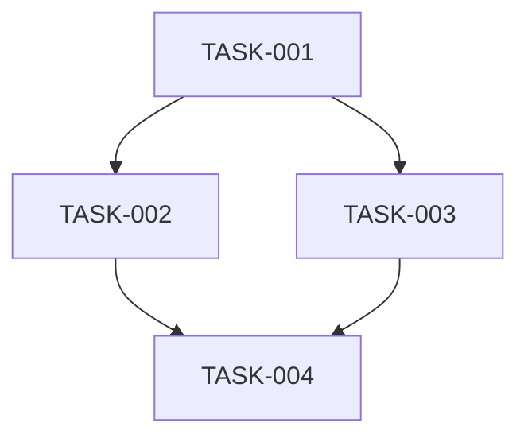

# Implementation Plan: [Ticket Title]

> **For agentic workers:** Use subagent-driven-development (recommended) or executing-plans to implement this plan task-by-task. Steps use checkbox (`- [ ]`) syntax for tracking.

**Ticket:** [ID] | **Date:** [Auto] | **Status:** Draft

**Goal:** [One sentence describing what this builds]

**Architecture:** [2-3 sentences about approach]

---

## File Structure

| File | Action | Responsibility |
|------|--------|---------------|
| `exact/path/to/file` | Create / Modify | [what this file does] |

---

## Tasks

### TASK-001: [Title]
- **Files:** `exact/path/to/create.ext`, `exact/path/to/modify.ext:123-145`
- **Dependencies:** none
- **Complexity:** S

- [ ] **Step 1: Write the failing test**
    ```language
    // actual test code — no placeholders
    ```
- [ ] **Step 2: Run test to verify it fails**
    Run: `<exact test command>`
    Expected: FAIL with "<expected error message>"
- [ ] **Step 3: Write minimal implementation**
    ```language
    // actual implementation code — no placeholders
    ```
- [ ] **Step 4: Run test to verify it passes**
    Run: `<exact test command>`
    Expected: PASS
- [ ] **Step 5: Commit**
    `git add <files> && git commit -m "feat: <description>"`

### TASK-002: [Title]
- **Files:** `exact/path/to/file.ext`
- **Dependencies:** TASK-001
- **Complexity:** M

- [ ] **Step 1: Write the failing test**
    ```language
    // actual test code
    ```
- [ ] **Step 2: Run test to verify it fails**
    Run: `<exact command>`
    Expected: FAIL
- [ ] **Step 3: Write minimal implementation**
    ```language
    // actual code
    ```
- [ ] **Step 4: Run test to verify it passes**
    Run: `<exact command>`
    Expected: PASS
- [ ] **Step 5: Commit**
    `git add <files> && git commit -m "feat: <description>"`

<!-- Continue for all tasks... -->

---

## Dependency Graph



## Estimated Total Complexity
- Small tasks: X
- Medium tasks: X
- Large tasks: X

## Traceability

| Requirement | Task(s) |
|-------------|---------|
| FR-001 | TASK-001, TASK-002 |
| FR-002 | TASK-003 |
